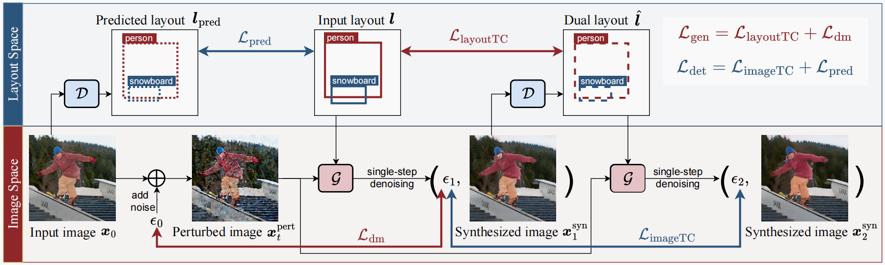
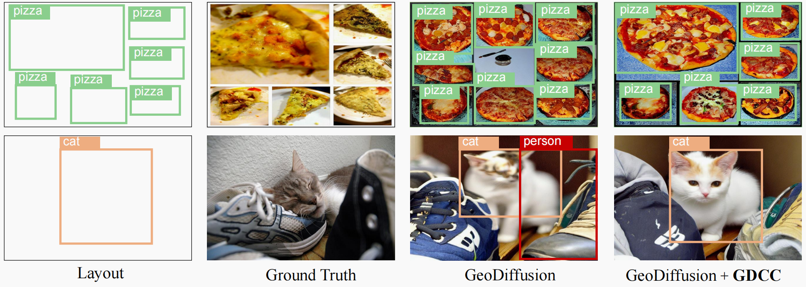
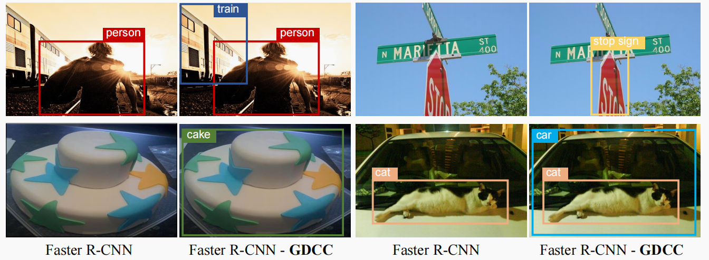

# GDCC

This anonymous repository contains the implementation of the paper:

> Cycle-Consistent Learning for Joint Layout-to-Image Generation and Object Detection <br>





## Installation

Clone this repo and create the GDCC environment with conda. We test the code under `python==3.7.16, pytorch==1.12.1, cuda=10.2` on Tesla V100 GPU servers. Other versions might be available as well.

1. Initialize the conda environment:

   ```bash
   conda create -n gdcc python=3.7 -y
   conda activate gdcc
   ```

2. Install the required packages:

   ```bash
   cd gdcc
   # when running training
   pip install -r requirements/train.txt
   # only when running inference with DPM-Solver++
   pip install -r requirements/dev.txt
   ```


## Download Pre-trained L2I Generation Models

We provide original L2I generation model and the model fine-tuned with GDCC for comparison. 

|        Dataset        |  L2I Model   | GDCC Fine-tune | Image Resolution | Grid Size |                           Download                           |
| :-------------------: |:------------:|:--------------:| :--------------: | :-------: | :----------------------------------------------------------: |
|      COCO-Stuff       | GeoDiffusion |       ×        |     256x256      |  256x256  | [HF Hub](https://huggingface.co/KaiChen1998/geodiffusion-coco-stuff-256x256) |
|      COCO-Stuff       | GeoDiffusion |       √        |     256x256      |  256x256  | [HF Hub](https://huggingface.co/AnonymousGDCC/GDCC/tree/main) |


## Detection Data Generation with L2I Generation Models after fine-tuning with GDCC

Download the pre-trained models and put them under the root directory. Run the following commands to run detection data generation with GeoDiffusion. For simplicity, we embed the layout definition process in the file `run_layout_to_image.py` directly. Check [here](./run_layout_to_image.py#L75-L82) for detailed definition.

```bash
python run_layout_to_image.py $CKPT_PATH --output_dir ./results/
```


## Train GDCC

### 1. Prepare dataset

We primarily use the [nuImages](https://www.nuscenes.org/nuimages) and [COCO-Stuff](https://cocodataset.org/#home) datasets for training GeoDiffusion. Download the image files from the official websites. For better training performance, we follow [mmdetection3d](https://github.com/open-mmlab/mmdetection3d/blob/main/configs/nuimages/README.md/#introduction) to convert the nuImages dataset into COCO format, while the converted annotation file for COCO-Stuff can be download via [HuggingFace](https://huggingface.co/datasets/KaiChen1998/coco-stuff-geodiffusion). The data structure should be as follows after all files are downloaded.

```
├── data
│   ├── coco
│   │   │── coco_stuff_annotations
│   │   │   │── train
│   │   │   │   │── instances_stuff_train2017.json
│   │   │   │── val
│   │   │   │   │── instances_stuff_val2017.json
│   │   │── train2017
│   │   │── val2017
│   ├── nuimages
│   │   │── annotation
│   │   │   │── train
│   │   │   │   │── nuimages_v1.0-train.json
│   │   │   │── val
│   │   │   │   │── nuimages_v1.0-val.json
│   │   │── samples
```

### 2. Launch distributed training


```bash
# fine-tune L2I generation model
bash tools/dist_train_cycle_finetune.sh \
	--dataset_config_name configs/data/coco_stuff_256x256.py \
	--output_dir work_dirs/gdcc_g_geodiffusion_coco_stuff_256x256
	
# fine-tune L2I generation model and detection model
bash tools/dist_train_cycle_detection_finetune.sh \
	--dataset_config_name configs/data/coco_stuff_256x256.py \
	--output_dir work_dirs/gdcc_gd_geodiffusion_coco_stuff_256x256
```


### 3. Launch batch inference


```bash
# COCO-Stuff
# We encourage readers to check https://github.com/ZejianLi/LAMA?tab=readme-ov-file#testing
# to report quantitative results on COCO-Stuff L2I benchmark.
bash tools/dist_test.sh PATH_TO_CKPT \
	--dataset_config_name configs/data/coco_stuff_256x256.py
```

## Evaluate GDCC
Please refer to [LAMA](https://github.com/ZejianLi/LAMA) for L2I generation model evaluation. We will update for more details.

## Qualitative Results

More results can be found in the main paper.






## Acknowledgement

We adopt the following open-sourced projects:

- [geodiffusion](https://github.com/KaiChen1998/GeoDiffusion): GeoDiffusion for L2I generation.
- [controlnet](https://github.com/lllyasviel/ControlNet): ControlNet for Controllable generation.
- [controlnet++](https://github.com/xinsir6/https://github.com/liming-ai/ControlNet_Plus_Plus): improve controls with consistency feedback.
- [diffusers](https://github.com/huggingface/diffusers/): basic codebase to train Stable Diffusion models.
- [mmdetection](https://github.com/open-mmlab/mmdetection): dataloader to handle images with various geometric conditions.
- [mmdetection3d](https://github.com/open-mmlab/mmdetection3d) & [LAMA](https://github.com/ZejianLi/LAMA): data pre-processing of the training datasets.
